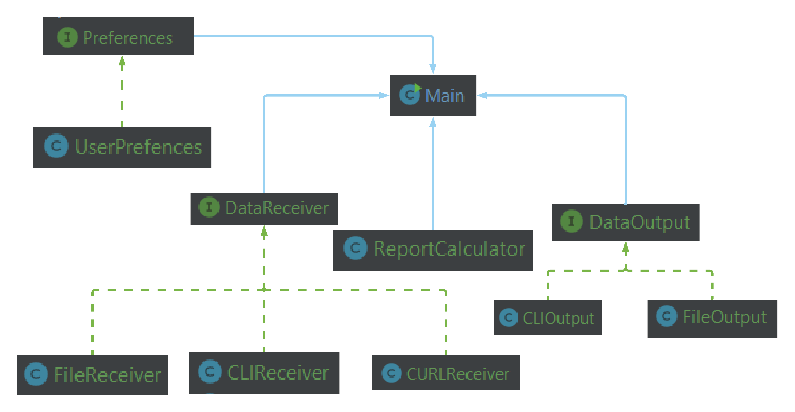

# Expenses

Student is looking for a monthly expense report, please help him to design and code the tool.

For this activity you have to use OOP core concepts and follow SOLID principles.

## General

This program will receive the following inputs:

1. Name of the student
2. Last name of the student
3. Student Id or code
4. Student email
5. A list of purchases that contains:

    - ``type``: it can be `General` or `Fixed`
    - ``name``: this refers to the purchase/item name. i.e. `Coffee`
    - ``price``: this refers to the purchase price, its type is `double`
    - ``currency``: this refers to the purchase price currency. All purchases are in `MXN`
    - ``receiver``: where this purchase was made. i.e `Starbucks`
    - ``date``: purchase date in format day/month/year. i.e. `12/08/2020`

6. Month to generate the expense report
7. Print report

## Input
Data input can come from different sources that is selected when program starts.

1. Console
    - All data (except for month to generate the expense report) is asked through the CLI (console) application
2. File
    - All data is saved in text file like this:
    ```$xslt
    {
        "name": "Student name",
        "lastname": "Student last name",
        "id": "AA234234234JH",
        "email": "student@tec.mx",
        "purchases":[
            {
                 "type":"General",
                 "name":"Nintendo switch",
                 "price":6500.00,
                 "currency":"MXN",
                 "receiver": "Amazon",
                 "date": "12/09/2020"
            },
            {
                "type":"Fixed",
                 "name":"Groceries",
                 "price":450.00,
                 "currency":"MXN",
                 "receiver": "Walmart",
                 "date": "12/09/2020"
            },
            {
                 "type":"General",
                 "name":"Coffe",
                 "price":56.00,
                 "currency":"MXN",
                 "receiver": "Starbucks",
                 "date": "12/09/2020"
            }
        ]
    }    
    ```   
3. From endpoint/URL
```$xslt
curl -i -H "Content-Type: application/json" -H "Accept: application/json" https://jsonblob.com/api/jsonBlob/124bbc39-7562-11eb-b01b-3ba7ac66d7b0
```

## Output
- Before generating the report:
    - User should be asked for what month the expense report should be generated
    - User should be asked in what type of currency wants the report. Supported currencies are ``MXN``, ``USD`` and ``BRL``
    - User should be asked about in what source the the report should be generated
        - Console
        - Save in file

The output needs to answer the next questions:

1. How many purchases were done today with details?
2. Min purchase, Max purchase, Average purchase and Frequent receiver.
    ```$xslt
    Purchases of today 25/08/2020: 2
    Starbucks with total of $198.00
    Amazon with total of $1,500.00
    
    Min purchase of the month: Walmart $12.00
    Max purchase of the month: Amazon $1,200.00
    Average purchases amount: $545.00
    Frequent receiver: Amazon
    ```
3. If there are multiple frequent receiver, they should be shown in as a comma separated list. i.e. ``Amazon, Walmart, Tiendita``
