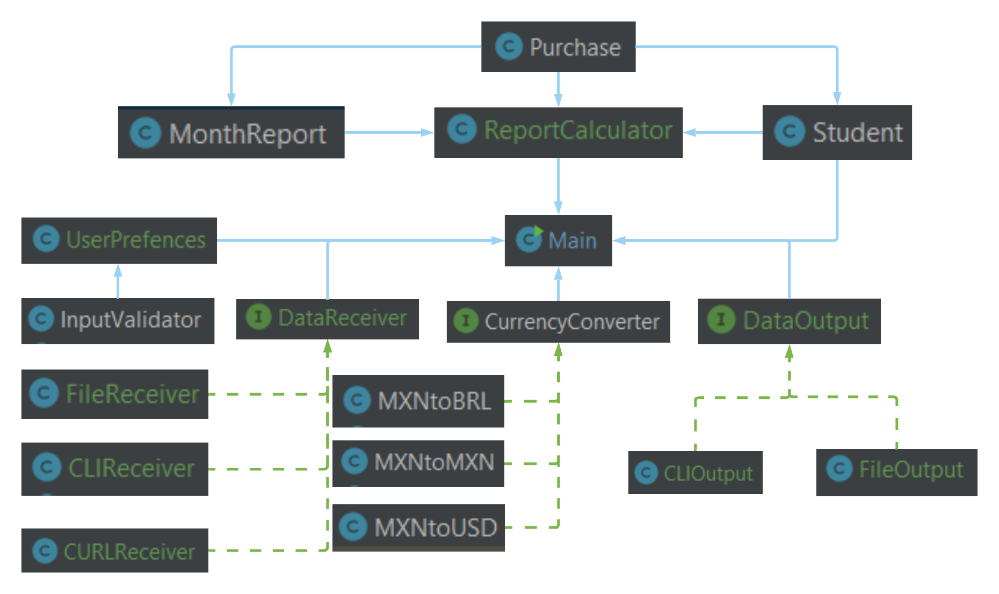

# Expenses


## Architecture Explanation

The main program is the one which runs evey other module who is in charge of every individual task and the main is the one coordinating those subtasks and its results through the implementation of polymorphism in different modules.

The `UserPreferences` class has the task to store and ask for every user input related to input or output preferences such as input mode (CLI, URL or File), output mode (Console or File) among others like output currency. It implements a very simple `InputValidator` to valide whether the inputs that `UserPreferences` receives are correct. One thing I would like to remark is that by typing only ``ENTER`` sets for you a the default value which is displayed on promt inout. 

Then, the `DataReceiver` interface is the one that depending on the user's input instantiates as one of the three classes that implement this, suuch classes are the following:

1. ``CLIReceiver``
    - The `input` is asked through command-line in an specific order.
3. ``FileReceiver``
    - `UserPreferences` asks for the file source containing the JSON formated data.
    - Reads the information the file contains and parse it into JSONOBject which is stored for further use.  
5. ``CURLReceiver``
    - `UserPreferences` asks for the URL endpoint for the JSON formated data response.
    - Reads the information the response contains and parse it into JSONOBject which is stored for further use.
d
We need to understand the `Entities` classes as I denominated them, these are data structures to contain the parsed information received from the `DataReceiver`. these classes are: 
    - ``Purchase``: Contains the information of a single purchase.
    - ``Student``: Contains the information of the student and a `LinkedList` of `Purchase` to contain the purchases' data.
    - ``MonthReport``: Contains a `LinkedList` of `Purchase` found from that month, max and min purchases and a receiver Map containing the times a receiver has been bought to in that specific month. 

For the calculations, a `Student` is instatiated and gets fed the data from the `DataReceiver` implemened class. After that `Student` is filled with the parsed information is then passed as an argument to create a new `ReportCalculator` instance with that `Student` and generates a `MonthReport` for each month and a `LinkedList` of today's purchases.

After calculations are done, `UserPreferences` asks for the currency format for the output and after its correctly inputed it asks now for the output mode. The Main process asks to the output to display the information which asks for the `String` output the `ReportCalculator`'s `summary` function returns. So inside that function is where the result string is constructed and this consturction uses the values that are passed through the `CurrencyConverter` instance that depend on the user input. There are 3 different classes implemented for the `CurrencyConverter` interface. These are:

1. ``MXNtoBRL``
2. ``MXNtoMXN`` (returns the same value)
3. ``MXNtoUSD``

After this explanation now we get to the part where the `DataOutput` interface implements one of the two following classes:

1. ``CLIOutput`` 
    - Prints the `ReportCalculator` summary `String` output to the console-line.
2. ``FileOutput``
    - `UserPreferences` asks the user for the file output name.
    - Writes the `ReportCalculator` summary `String` output to the file output.

## Problem Explanation

Student is looking for a monthly expense report, please help him to design and code the tool.

For this activity you have to use OOP core concepts and follow SOLID principles.

## General

This program will receive the following inputs:

1. Name of the student
2. Last name of the student
3. Student Id or code
4. Student email
5. A list of purchases that contains:

    - ``type``: it can be `General` or `Fixed`
    - ``name``: this refers to the purchase/item name. i.e. `Coffee`
    - ``price``: this refers to the purchase price, its type is `double`
    - ``currency``: this refers to the purchase price currency. All purchases are in `MXN`
    - ``receiver``: where this purchase was made. i.e `Starbucks`
    - ``date``: purchase date in format day/month/year. i.e. `12/08/2020`

6. Month to generate the expense report
7. Print report

## Input
Data input can come from different sources that is selected when program starts.

1. Console
    - All data (except for month to generate the expense report) is asked through the CLI (console) application
2. File
    - All data is saved in text file like this:
    ```$xslt
    {
        "name": "Student name",
        "lastname": "Student last name",
        "id": "AA234234234JH",
        "email": "student@tec.mx",
        "purchases":[
            {
                 "type":"General",
                 "name":"Nintendo switch",
                 "price":6500.00,
                 "currency":"MXN",
                 "receiver": "Amazon",
                 "date": "12/09/2020"
            },
            {
                "type":"Fixed",
                 "name":"Groceries",
                 "price":450.00,
                 "currency":"MXN",
                 "receiver": "Walmart",
                 "date": "12/09/2020"
            },
            {
                 "type":"General",
                 "name":"Coffe",
                 "price":56.00,
                 "currency":"MXN",
                 "receiver": "Starbucks",
                 "date": "12/09/2020"
            }
        ]
    }    
    ```   
3. From endpoint/URL
```$xslt
curl -i -H "Content-Type: application/json" -H "Accept: application/json" https://jsonblob.com/api/jsonBlob/124bbc39-7562-11eb-b01b-3ba7ac66d7b0
```

## Output
- Before generating the report:
    - User should be asked for what month the expense report should be generated
    - User should be asked in what type of currency wants the report. Supported currencies are ``MXN``, ``USD`` and ``BRL``
    - User should be asked about in what source the the report should be generated
        - Console
        - Save in file

The output needs to answer the next questions:

1. How many purchases were done today with details?
2. Min purchase, Max purchase, Average purchase and Frequent receiver.
    ```$xslt
    Purchases of today 25/08/2020: 2
    Starbucks with total of $198.00
    Amazon with total of $1,500.00
    
    Min purchase of the month: Walmart $12.00
    Max purchase of the month: Amazon $1,200.00
    Average purchases amount: $545.00
    Frequent receiver: Amazon
    ```
3. If there are multiple frequent receiver, they should be shown in as a comma separated list. i.e. ``Amazon, Walmart, Tiendita``
